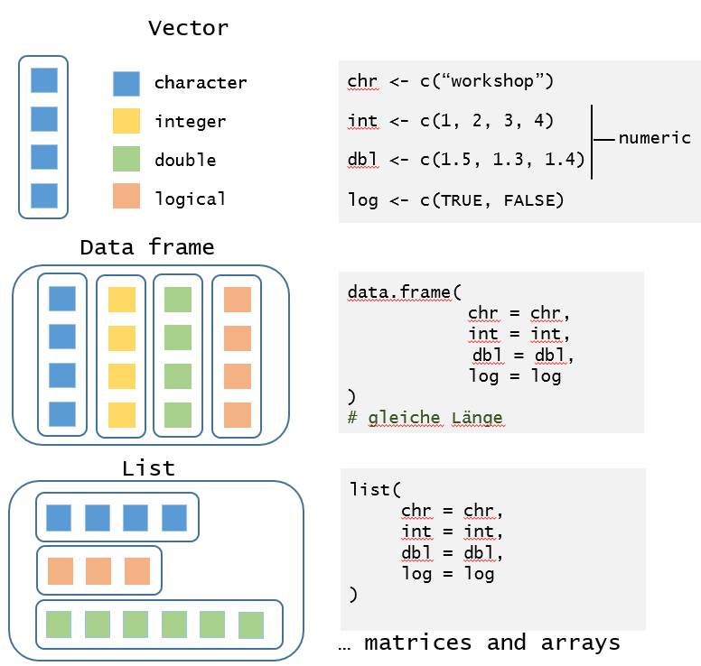
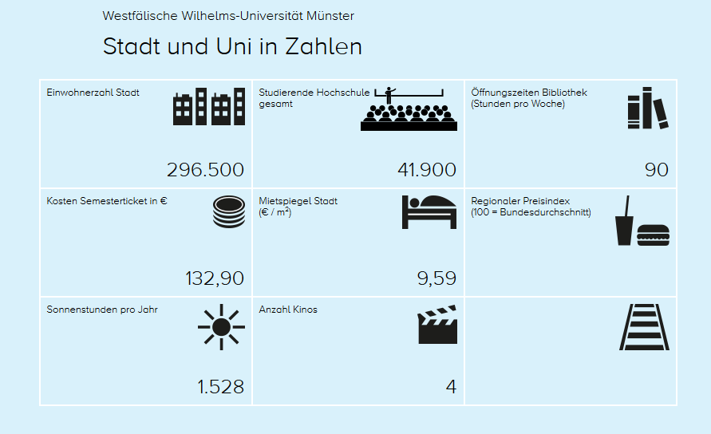
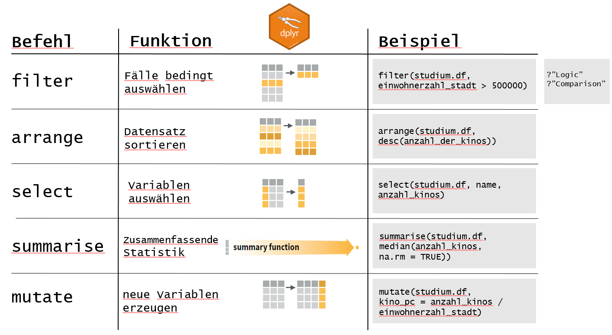

```{r setup, include = FALSE}
options(htmltools.dir.version = FALSE)

if(!require("pacman")) install.packages("pacman")
p_load(tidyverse, rvest, httr, robotstxt, qdap, janitor, lubridate,
       knitr, kableExtra, cowplot)
```

# Vorteile von R

- Open Source 
- Riesige Community (z.B. [StackOverflow](https://stackoverflow.com/questions/tagged/r))
- Stetige Weiterentwicklung ([CRAN](https://cran.r-project.org/))
- [Visualisierung](https://socviz.co/index.html) & [digitale Methoden](https://www.bitbybitbook.com/en/1st-ed/preface/)

---

# Steile Lernkurve?

.pull-left[

**Früher:**

R = schwer erlernbar

**Inzwischen:**

- Onlinekurse
- Bücher
- Videos
- ... 

]

.pull-right[

```{r, out.width = "80%", echo = FALSE}
# Source: https://boyter.org/static/books/Cf7eHZ1W4AEeZJA.jpg
include_graphics("Figures/OReally-Trying.jpg")
```

]

---

# Installation

- Programmiersprache: [R](https://cran.r-project.org/index.html) 
- Entwicklungsumgebung [RStudio](https://www.rstudio.com/products/rstudio/)
- [Pakete](https://r4ds.had.co.nz/introduction.html#the-tidyverse)

-> kurze [Installationsanleitung](https://r4ds.had.co.nz/introduction.html#prerequisites)

R kann zunächst auch über die [RStudioCloud](https://rstudio.cloud/) ausprobiert
werden. Es ist aber eine vorherigen Anmeldung notwendig. Der Service ist kostenfrei. 

```{r mysetup, echo = TRUE, eval = FALSE}
install.packages(pacman) # Installation nur einmal notwendig
library(pacman)
p_load(tidyverse)
```

---

# Crashkurs R

- Fokus auf Datentypen & -aufbereitung mit [dplyr](https://dplyr.tidyverse.org/)
- Daten zur [Studienwahl](https://www.studium.org/kommunikationswissenschaft/uebersicht-universitaeten) im Feld "Medien- und Kommunikationswissenschaften"

Nachlesen:

- Wickham & Grolemund (2017) ["R for Data Science"](https://r4ds.had.co.nz/)
- Tutorial von [RStudio](https://rstudio.cloud/learn/primers)

---

# Datentypen

```{r types_fig, out.width = "60%", echo = FALSE}

```

Nachlesen: [Wickham (2019)](https://adv-r.hadley.nz/vectors-chap.html)

---

# Datentypen in R

```{r rdatatype, echo = TRUE, eval = FALSE}
# Vector
chr_vector <- c("test1", "testX", "TEST")

# Dataframe/tibble
df <- data.frame(ch = chr_vector,
                 nmrc = c(1, 2, 3))

# List
tlist <- list(e1 = df, 
              chr_vector)
```

---

# Daten: Studium.org

```{r studium_fig, out.width = "80%", echo = FALSE}
# https://www.studium.org/kommunikationswissenschaft/uni-muenster

```

Studienwahl: Medien- und Kommunikationswissenschaften

- Wo soll ich studieren?
- Was gibt mein Geldbeutel her?
- Was bietet der Studienort an kulturellen Angeboten?

---

# Daten: Studium.org II

- 56 Datenpunkte (eben soviele Einzelseiten, z.B. [Münster](https://www.studium.org/kommunikationswissenschaft/uni-muenster))
- Copy&Paste mühsam und fehleranfällig
- Anwendungsbeispiel: Web Scraping (s. [Skript](https://github.com/FabianFox/Webscraping-Muenster-/blob/master/Code/StudiumOrg-KoWi-Scraper.R))

Datensatz laden:

```{r studi_df, echo = TRUE, eval = FALSE}
# empfohlen
studium.df <- readRDS(gzcon(url("https://github.com/FabianFox/Webscraping-Muenster-/blob/master/Data/KoWi-Institute.RDS?raw=true")))

# Skript ausführen (Dauer: ~5min)
# devtools::source_url("https://raw.githubusercontent.com/FabianFox/Webscraping-Hamburg-/master/Code/SoziologieOrg-Scraper.R")
```

```{r studi_load, echo = FALSE, eval = TRUE}
studium.df <- readRDS("./Data/KoWi-Institute.RDS")
```

---

# Daten: Studium.org III

Welche Variablen stehen zur Verfügung?

```{r describe_df, echo = TRUE, eval = TRUE}
# (1) dplyr laden
library(dplyr)

# (2) Überblick
glimpse(studium.df)
```

---

# Datenexploration mit dplyr

Fünf Befehle, die die Datenaufbereitung und -analyse unterstützen (vgl. [Wickham & Grolemund 2017](https://r4ds.had.co.nz/transform.html) & [Cheatsheet](https://github.com/rstudio/cheatsheets/raw/master/data-transformation.pdf)):

```{r dplyr_fig, out.width = "100%", echo = FALSE}

```

---

# Kombination von Befehlen

```{r dplyr_cmb, echo = TRUE, eval = TRUE}
# (1) Kopie des Datensatzes
stdm.copy <- studium.df
# (2) Select: Name, Kino, Einwohner
stdm.copy <- select(stdm.copy, name, anzahl_kinos, einwohnerzahl_stadt)
# (3) Erstelle Kinos pro Kopf
stdm.copy <- mutate(stdm.copy, kino_pc = anzahl_kinos / einwohnerzahl_stadt)
# (4) Wähle Fälle > Median(Kino pro Kopf)
stdm.copy <- filter(stdm.copy, kino_pc > median(kino_pc, na.rm = TRUE))
# (5) Sortiere Kino pro Kopf (absteigend)
stdm.copy <- arrange(stdm.copy, desc(kino_pc))

glimpse(stdm.copy)
```

---

# Nachteile

- ausführlich (Tippfehler!)
- viele Kopien eines Datensatzes
- redundant

Weitere Möglichkeit:

```{r bad_chain, echo = TRUE, eval = TRUE}
arrange(filter(mutate(select(studium.df, name, anzahl_kinos, einwohnerzahl_stadt), kino_pc = anzahl_kinos / einwohnerzahl_stadt), kino_pc > median(kino_pc, na.rm = TRUE)), desc(kino_pc))
```

---

## Die Pipe (%>%)

```{r magrittr_fig, echo = FALSE, out.width = "10%"}
include_graphics("Figures/pipe_hex.PNG")
```

Pipe-Operator: `%>%`

- verknüpft Befehle
- wird als "und dann" gelesen

--

1. Verwende den Datensatz `studium.df` (dann `%>%`) 
2. Wähle Variablen aus (dann `%>%`)
3. Erzeuge die Variable `kino_pc` (dann `%>%`) 
4. Verwende Fälle, die größer als der Median sind (dann `%>%`)
5. Sortiere den Datensatz (abnehmende Kinozahl pro Kopf)

```{r pipe_exm, echo = TRUE, eval = FALSE}
studium.df %>%    
  select(name, anzahl_kinos, einwohnerzahl_stadt) %>%
  mutate(kino_pc = anzahl_kinos / einwohnerzahl_stadt) %>%
  filter(kino_pc > median(kino_pc, na.rm = TRUE)) %>%
  arrange(desc(kino_pc))
```

---

# Komplexe Rekodierung

[case_when](https://dplyr.tidyverse.org/reference/case_when.html):

```{r case_group, echo = TRUE, eval = TRUE}
studium.df <- studium.df %>%
  mutate(
    stadt_typ = case_when(
      einwohnerzahl_stadt < 100000 ~ "stadt",
      einwohnerzahl_stadt < 500000 ~ "großstadt",
      einwohnerzahl_stadt > 500000 ~ "metropole",
      TRUE ~ NA_character_))
```

---

# Übungen

- Wie teuer ist ein Semesterticket im Durchschnitt?
- Welche zehn Städte bieten das günstigste Ticket?
- Unterscheidet Ticketpreis nach Stadttyp (Stadt/Großstadt/Metropole)? (Tipp: `?group_by`)

---

# Visualisierung

Paket: ggplot2 (Einführung: [Healy 2018](http://socviz.co/))

```{r ggplot2_exm, echo = FALSE, eval = TRUE, out.width = "70%", dpi = 300}
studium.df %>% 
  filter(!is.na(sonnenstunden_pro_jahr)) %>%
  ggplot() +
  geom_point(aes(fct_reorder(name, sonnenstunden_pro_jahr), sonnenstunden_pro_jahr), 
             stat = "identity") +
  labs(title = "Deutsche KoWi-Institute nach Sonnenstunden im Jahr",
       subtitle = paste0("Die Differenz zwischen Berlin und Münster beträgt ", 
                         round(
                           abs(
                             studium.df$sonnenstunden_pro_jahr[studium.df$name == "uni-muenster"] -
                             studium.df$sonnenstunden_pro_jahr[studium.df$name == "udk-berlin"]) /
                             24, 
                           digits = 1),
                         " Sonnentage im Jahr."),
       x = "", y = "", caption = "Quelle: studium.org") +
  geom_point(data = subset(studium.df, name %in% c("uni-muenster", "udk-berlin")),
             aes(fct_reorder(name, sonnenstunden_pro_jahr), sonnenstunden_pro_jahr), 
             stat = "identity", color = "red", size = 4) +
  theme_minimal() +
  theme(axis.text.x = element_text(angle = 45, hjust = 1), 
        panel.grid.minor.x = element_blank(),
        panel.grid.major.x = element_blank(),
        text = element_text(size = 10),
        axis.ticks = element_line(size = .5))
```

---

# Lernressourcen

Bücher:

- Wickham & Grolemund (2017) R for Data Science [(online)](https://r4ds.had.co.nz/)
- Healy (2018) Data Visualization [(online)](https://socviz.co/index.html)
- Phillips (2018) YaRrr! The Pirate’s Guide to R [(online)](https://bookdown.org/ndphillips/YaRrr/)

Interaktiv:

- RStudioPrimers [(online)](https://rstudio.cloud/learn/primers)
- swirl: Learn R, in R [(Installation)](https://swirlstats.com/students.html)

Kurzanleitungen:

- Cheatsheets [(online)](https://www.rstudio.com/resources/cheatsheets/)

Weiterführend:
- Sammlung von Lernressourcen auf RStudio [(online)](https://www.rstudio.com/resources/)
- Lerncommunity: [TidyTuesdays](https://github.com/rfordatascience/tidytuesday)