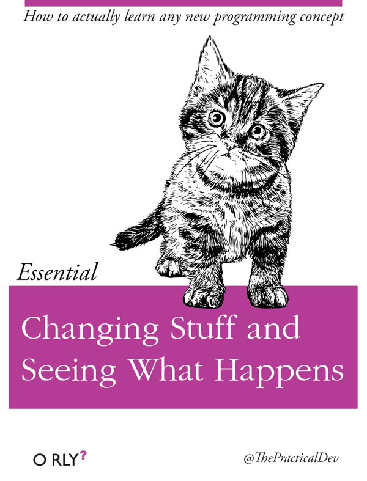

```{r setup, include=FALSE}
options(htmltools.dir.version = FALSE)
pacman::p_load(knitr)
```

# Vorteile von R

- Open Source 
- Riesige Community (z.B. [StackOverflow](https://stackoverflow.com/questions/tagged/r))
- Stetige Weiterentwicklung ([CRAN](https://cran.r-project.org/))
- [Visualisierung](https://socviz.co/index.html) & [digitale Methoden](https://www.bitbybitbook.com/en/1st-ed/preface/)

---

# Steile Lernkurve?

.pull-left[

Früher:

R = schwer erlernbar

Inzwischen:

- Onlinekurse
- Bücher
- Videos
- ... 

]

.pull-right[

```{r, out.width = "80%", echo = FALSE}
# Source: https://boyter.org/static/books/Cf7eHZ1W4AEeZJA.jpg

```

]

---

# Installation

- Programmiersprache: [R](https://cran.r-project.org/index.html) 
- Entwicklungsumgebung [RStudio](https://www.rstudio.com/products/rstudio/)
- [Pakete](https://r4ds.had.co.nz/introduction.html#the-tidyverse)

-> kurze [Installationsanleitung](https://r4ds.had.co.nz/introduction.html#prerequisites)

R kann zunächst auch über die [RStudioCloud](https://rstudio.cloud/) ausprobiert
werden. Es ist aber eine vorherigen Anmeldung notwendig. Der Service ist kostenfrei. 

---

# Lernressourcen

Bücher:

- Wickham & Grolemund (2017) R for Data Science [(online)](https://r4ds.had.co.nz/)
- Healy (2018) Data Visualization [(online)](https://socviz.co/index.html)
- Phillips (2018) YaRrr! The Pirate’s Guide to R [(online)](https://bookdown.org/ndphillips/YaRrr/)

Interaktiv:

- RStudioPrimers [(online)](https://rstudio.cloud/learn/primers)
- swirl: Learn R, in R [(Installation)](https://swirlstats.com/students.html)

Kurzanleitungen:

- Cheatsheets [(online)](https://www.rstudio.com/resources/cheatsheets/)

Weiterführend:
- Sammlung von Lernressourcen auf RStudio [(online)](https://www.rstudio.com/resources/)
- Lerncommunity: [TidyTuesdays](https://github.com/rfordatascience/tidytuesday)

---

# Kursvorbereitung

Installationen:
- R und RStudio
- [tidyverse](https://www.tidyverse.org/packages/) ([Installation](https://r4ds.had.co.nz/introduction.html#the-tidyverse)) 
- Internetverbindung...

Mögliche Vorbereitung:
- R for Data Science 
    - Kapitel: [1](https://r4ds.had.co.nz/introduction.html), [2](https://r4ds.had.co.nz/explore-intro.html), ([3](https://r4ds.had.co.nz/data-visualisation.html)), [4](https://r4ds.had.co.nz/workflow-basics.html), [5](https://r4ds.had.co.nz/transform.html), [6](https://r4ds.had.co.nz/workflow-scripts.html) 
    - Kap. 3 "Visualisierung" ist nicht notwendig aber empfehlenswert
- Anwendung: Work with Data ([online](https://rstudio.cloud/learn/primers/2))