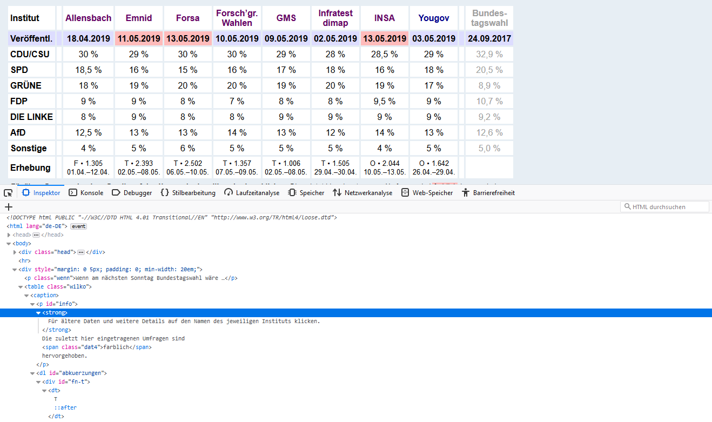
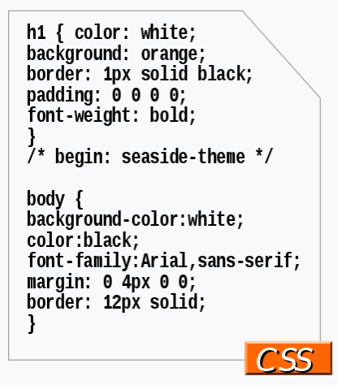
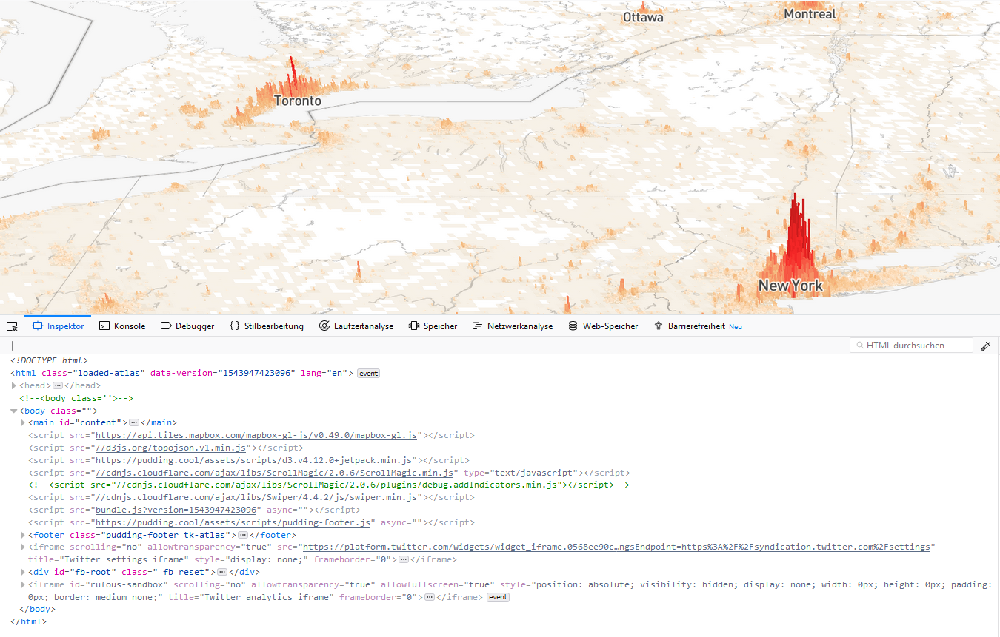
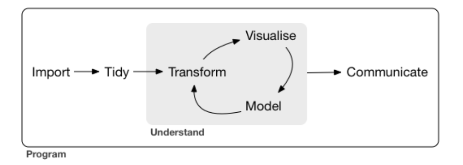
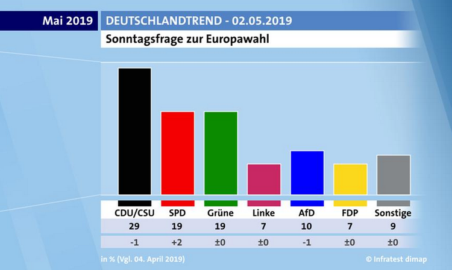
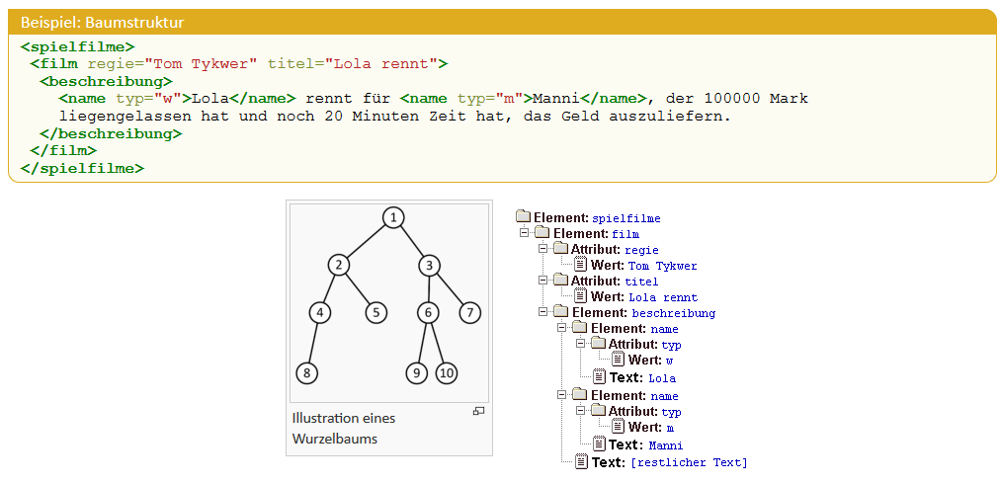
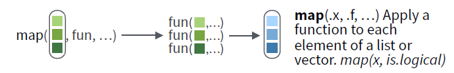
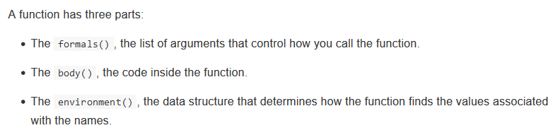

# Inhalt

```{r setup, include = FALSE}
options(htmltools.dir.version = FALSE)

if(!require("pacman")) install.packages("pacman")
p_load(tidyverse, rvest, httr, robotstxt, qdap, janitor, lubridate,
       knitr, kableExtra, cowplot)
```

1. Einleitung
2. Web Scraping
    + Technologien des WWW
    + Web Scraping in R
        + a) Generelles Schema
        + b) Spezielle Technologien
3. Rechtliche & ethische Aspekte
4. Weitere Beispiele und Anwendungen
5. Weiterlernen

---

# Zur Präsentation

- Folien sind online verfügbar: https://github.com/FabianFox/Webscraping-Muenster-Slides
    - Folien herunterladen und im Browser öffnen
- Beispiele auf [GitHub](https://github.com/FabianFox/Webscraping-Muenster-)
- Benötigte Pakete über: 

```{r mysetup, echo = TRUE, eval = FALSE}
install.packages(pacman) # Installation nur einmal notwendig
library(pacman)
p_load(tidyverse, rvest, httr, robotstxt, qdap, janitor,
       devtools, lubridate)
```

---

# 1. Einleitung

Ziele des Workshops:

- Web Scraping als Methode
    - Grundlagen: WWW
    - Umsetzung in R
    - Beispiele
- Quellen zum Selbststudium kennenlernen

---

# 2. Web Scraping

> "...something big is going on" ([Salganik 2018: 2](https://www.bitbybitbook.com/en/1st-ed/preface/))

- Übergang vom analogen zum digitalen Zeitalter
    - kommende Krise der empirischen Soziologie ([Savage & Burrows 2007](https://journals.sagepub.com/doi/10.1177/0038038507080443#articleShareContainer))?
    - neue Möglichkeiten und/oder Gefahren ([Salganik 2018: 17-41](https://www.bitbybitbook.com/en/1st-ed/observing-behavior/characteristics/))
    
> "'computational social science' (CSS) is occurring. The question is whether
> it happens with or without social scientists" ([Heiberger & Riebling 2016: 1](https://journals.sagepub.com/doi/abs/10.1177/2059799115622763))

---

# Digitale Daten

- positiv: big, always-on, nonreactive
- negativ: incomplete, inaccessible, nonrepresentative, drifting, algorithmically 
confounded, dirty, sensitive

Quelle: [Salganik 2018: 17-41](https://www.bitbybitbook.com/en/1st-ed/observing-behavior/characteristics/)

---

# Technologien des WWW

.pull-left[

Infrastruktur des Internets im Alltag irrelevant.

Unser Browser übernimmt:

- Serveranfragen (Request/Response: HTTP)
- Darstellung von HTML, CSS und JavaScript

Um Informationen gezielt abzufragen, benötigen wir allerdings basale Kenntnisse 
der zugrundeliegenden Technologien.

]

.pull-right[

```{r greer_fig, echo = FALSE, out.width = "80%"}
# Source: https://davegreer.cc/INTERNET

```

]

---

# HTTP I

**H**yper**t**ext **T**ransfer **P**rotocol [(HTTP)](https://en.wikipedia.org/wiki/Hypertext_Transfer_Protocol)

```{r http_fig, out.width = "50%", echo = FALSE}
# Source: https://code.tutsplus.com/tutorials/http-the-protocol-every-web-developer-must-know-part-1--net-31177
include_graphics("Figures/http-request-response.png")
```

- Übertragungsprotokoll, welches aus zwei Teilen besteht:

    - Request (Client)
    - Response (Server)

---

# HTTP II

- Requests erfolgen über **U**niform **R**esource **L**ocators [(URL)](https://en.wikipedia.org/wiki/URL)
    - Teile der URL können genutzt werden, um Informationen zu extrahieren
    
```{r url_fig, out.width = "50%", echo = FALSE}
# Source: https://code.tutsplus.com/tutorials/http-the-protocol-every-web-developer-must-know-part-1--net-31177
include_graphics("Figures/http-url-structure.png")
```

---

# Beispiel: HTTP I

- `GET`-Abfrage mit `httr::GET` und Antwort des Servers in R

```{r, echo = TRUE, eval = TRUE}
# install.packages("httr")
p_load(httr)
response <- GET("https://www.wahlrecht.de/umfragen/index.htm") %>%
  print()
```

---

# Beispiel: HTTP II

```{r, echo = TRUE, eval = TRUE, message = FALSE, warning = FALSE}
#install.packages("rvest")
library(rvest)

survey <- response %>% 
  read_html() %>% 
  html_table(".wilko", 
             header = TRUE,    # first row: header
             fill = TRUE) %>%  # fill with NA
  .[[2]] %>%                   # select data frame
  glimpse()
```

---

# Beispiel: HTTP III

```{r ggplot2_aw, echo = FALSE, eval = TRUE, out.width = "65%", dpi = 300}
survey %>%
  .[2:7, c(1,3)] %>%
  mutate(results = str_extract(string = `Allensbach`,
                               pattern = "[:digit:]+,?[:digit:]?"),
         results = str_replace(results,
                               pattern = ",", replacement = "."),
         results = as.numeric(results),
         Institut = factor(Institut, levels = c("CDU/CSU", "SPD", "GRÜNE", "FDP", "DIE LINKE", "AfD"))) %>%
  ggplot(aes(x = Institut, y = results, fill = Institut)) +
  geom_bar(stat = "identity") +
  scale_fill_manual(values = c("#000000", "#EB001F", "#64A12D", 
                               "#FFED00", "#BE3075", "#009EE0"),
                     guide = guide_legend(title = NULL)) +
  labs(x = "", y = "", 
       title = "Sonntagsfrage: Wenn am nächsten Sonntag Bundestagswahl wäre...",
       Quelle = "Wahlrecht.de") +
  scale_y_continuous(labels = function(x) paste0(x, "%")) +
  theme_minimal() +
  theme(axis.text.x = element_text(angle = 45, hjust = 1), 
        panel.grid.minor.x = element_blank(),
        panel.grid.major.x = element_blank(),
        text = element_text(size = 10),
        axis.ticks = element_line(size = .5))
```

---

# HTML

**H**yper**t**ext **M**arkup **L**anguage [(HTML)](https://www.w3schools.com/html/default.asp)

- einfacher Text mit weiteren Anweisungen (Tags, Attributes...)
- wird vom Browser interpretiert und dargestellt
    
HTML-Code ist über die Webentwicklungstools des Browsers verfügbar
- Rechtsklick -> Seitenquelltext anzeigen

---

# Beispiel: HTML I

Einfache Seiten über Editor/Notepad++ erstellbar:

```{r, eval = FALSE, echo = TRUE}
<!DOCTYPE html>
<html>

<head>
<title>Workshop Web Scraping</title>
</head>

<body>
<h1> Web Scraping mit R, Universit&auml;t Münster</h1>
<p>Dieser Kurs f&uuml;hrt in das "Web Scraping" mit R ein. Er wird durch <a href="https://fguelzau.rbind.io/">Fabian G&uuml;lzau</a> geleitet.</p>

</body>
</html>
```

Der Browser interpretiert den Code und zeigt eine [Internetseite](http://htmlpreview.github.io/?https://github.com/FabianFox/Webscraping-Muenster-/blob/master/Code/HTML-Example.html) an.

---

# Beispiel: HTML II

HTML:

- hat eine Baumstruktur
- Markup-Elemente helfen uns Informationen zu lokalisieren (Relationalität)
    - **D**ocument **O**bject **M**odel [(DOM)](https://en.wikipedia.org/wiki/Document_Object_Model)
    - Darstellung von HTML in R (parsing)
    
```{r wahl_tree, out.width = "70%", echo = FALSE}

```

---

# CSS

**C**ascading **S**tyle **S**heet [(CSS)](https://www.w3schools.com/css/default.asp)

- beinhaltet Informationen über den Stil der HTML-Seite
- kann genutzt werden, um Informationen zu lokalisieren (CSS-Selektoren)

```{r css_fig, out.width = "30%", echo = FALSE}
# Source: https://en.wikipedia.org/wiki/Cascading_Style_Sheets

```

---

# JavaScript

[JavaScript](https://www.w3schools.com/js/default.asp): "Programmiersprache des Internets"

- macht Internetseiten dynamisch
- Inhalte erscheinen erst nach Ausführung von JS 
    - problematisch für unsere Scraper

```{r java_fig, out.width = "50%", echo = FALSE}
# Source: https://pudding.cool/2018/12/3d-cities-story/

```

---

# 2a) Web Scraping: Generelles Schema

Web Scraping-Projekte folgen einem generellen Schema:

1. Internetseite kennenlernen
2. Import von HTML-Dateien
3. Information isolieren
4. Iteration (loops)

```{r, out.width = "50%", echo = FALSE}
# Source: https://r4ds.had.co.nz/introduction.html

```

Quelle: [Wickham & Grolemund (2018)](https://r4ds.had.co.nz/introduction.html)

---

# Web Scraping in R

```{r, out.width = "8%", echo = FALSE}
# Source: http://hexb.in/
include_graphics("Figures/rvest_hex.PNG")
```

.pull-left[

1. Internetseite kennenlernen
2. Import von HTML-Dateien
3. Information isolieren
4. Iteration (loops)

]

--

.pull-right[

Das generelle Schema lässt sich in R über das Paket [`rvest`](https://github.com/hadley/rvest) umsetzen:

1. u.a. [`robotstxt`](https://github.com/ropensci/robotstxt)
2. `read_html`: Import von HTML/XML-Dateien
3. Information isolieren
    - `html_nodes`: Extrahiert Teile des HTML-Dokument mit Hilfe von XPath/CSS-Selektoren
    - `html_text` / `html_attr` / `html_table`: Extrahiert Text, Attribute und Tabellen
4. `map` (package: [purrr](https://purrr.tidyverse.org/)): Iteration (loops)

]

--

---

# Beispiel: Sonntagsfrage

- **Sonntagsfrage**
    - von verschiedenen Umfrageinstituten erhoben ([Wahlrecht.de](https://www.wahlrecht.de/umfragen/))
    - Archivfunktion (zeitlicher Verlauf)
    
**Ziel**: Aktuelle Umfragen aller Institute herunterladen und kombinieren.

```{r, out.width = "50%", echo = FALSE}
# Source: https://www.tagesschau.de/inland/deutschlandtrend/

```

Quelle: [Tagesschau.de](https://www.tagesschau.de/inland/deutschlandtrend/)

---

# (1) Kennenlernen der Internetseite

Fragen, die beantwortet werden sollten:

- statische oder dynamische Internetseite
    - statisch: [`rvest`](https://github.com/hadley/rvest)
    - dynamisch: [`RSelenium`](https://github.com/ropensci/RSelenium)
- Web Scraping erlaubt
    - Terms of Service (ToS)
    - robots.txt

---

# Wahlrecht: Kennenlernen der Internetseite

Hierzu gehört:

- Seitenquelltext: **statisch**
- HTML-Tags der Zielinformation: **table / class: wilko**
- robots.txt / Terms of Service: **keine relevanten Beschränkungen**

```{r echo = TRUE, eval = TRUE}
paths_allowed(
  paths  = c("/index.htm","/allensbach.htm"), 
  domain = c("wahlrecht.de")
)
```

---

# (2) Import von HTML-Dateien

Internetseiten müssen in ein Format übersetzt werden, welches von R gelesen und
bearbeitet werden kann (z.B. Baumstruktur).

Benötigt wird:

- URL 
- Request/Response-Paar

---

# Wahlrecht: Import von HTML-Seiten

Über `rvest::read_html`:

```{r echo = TRUE, eval = TRUE}
(html.page <- read_html("https://www.wahlrecht.de/umfragen/allensbach.htm"))
```

---

# (3) Information isolieren

Zur Extraktion von Informationen nutzen wir die Baumstruktur von HTML:

- [XPath](https://www.w3schools.com/xml/xpath_intro.asp)
- [CSS-Selektoren](https://www.w3schools.com/csSref/css_selectors.asp)

```{r tree_fig2, out.width = "80%", out.height = "85%", echo = FALSE}
# Source: https://wiki.selfhtml.org/wiki/XML/Regeln/Baumstruktur

```

Quelle: [selfhtml.de](https://wiki.selfhtml.org/wiki/XML/Regeln/Baumstruktur)

---

# XPath und CSS-Selektoren: Tools

Wir konstruieren Selektoren selten manuell, da Anwendungen dies übernehmen.

Tools:

- [Selector Gadget](https://selectorgadget.com/)
- Browser: [Webentwicklungstools](https://developer.mozilla.org/de/docs/Tools/Seiten_Inspektor)
- Lerntools: [CSS Diner](https://flukeout.github.io/)

---

# Wahlrecht: CSS-Selektor

HTML-Tabellen lassen sich oft besonders leicht identifizieren, da sie das Tag 
"table" tragen: 

```{r node_exm, echo = TRUE, eval = TRUE}
(html.node <- html_nodes(html.page, css = ".wilko")) 
```

---

# Wahlrecht: Umwandeln in Text/Tabelle

Wir sind selten am HTML-Tag interessiert, sondern an dem Inhalt:

```{r table_trans, echo = TRUE, eval = TRUE}
html.table <- html.node %>%
  html_table(header = TRUE, fill = TRUE) %>%
  .[[1]] %>%                                 # body
  .[4:nrow(.), c(1, 3:9)] %>%                # subsetting
  glimpse()
```

zum Subsetting: [Wickham (2019)](https://adv-r.hadley.nz/subsetting.html)

---

# Exkurs: Regex

.left-column[

```{r oreally_fig1, out.width = "90%", out.height = "95%", echo = FALSE}
# Source: https://boyter.org/2016/04/collection-orly-book-covers/

```

]

.right-column[

**Reg**ular **Ex**pression

- zur Suche von Ausdrücken (patterns) in Text (strings)
- in R z.B. über [`stringr`](https://stringr.tidyverse.org/index.html)

```{r string_exm, echo = TRUE, eval = TRUE}
str_view(string = "Wir benötigen nicht den gesamten Text, sondern die 42.",
         pattern = "[:digit:]+")
```

]

---

# Wahlrecht: Regex

Die Umfrageergebnisse liegen als "strings" vor, sodass wir sie für die Datenanalyse 
in numerische Werte umwandeln müssen.

```{r str_view, echo = TRUE, eval = TRUE}
str_view(string = html.table$`CDU/CSU`[1:5],
         pattern = "[:digit:]+,?[:digit:]?")
```

---

# Datenaufbereitung

Wir ersetzen zudem die Kommata durch Punkte und wandeln die Daten in ein 
"long"-Format um:

```{r allensbach_clean, echo = TRUE, eval = TRUE}
allensbach.df <- html.table %>%
  rename("Zeitpunkt" = 1) %>%                                 # 1. Variable benennen                    
  mutate(Zeitpunkt = parse_datetime(Zeitpunkt,                # 2. als Datum
                                    format = "%d.%m.%Y")) %>%
  mutate_if(is.character, str_extract,                        # 3a. Zahl entnehmen
            pattern = "[:digit:]+,?[:digit:]?") %>%
  mutate_if(is.character, str_replace,                        # 3b. Komma als Punkt
            pattern = ",", replacement = ".") %>%
  mutate_if(is.character, as.numeric) %>%                     # 3c. als Zahl
  gather(party, vote, -Zeitpunkt) %>%                         # 4. long format
  glimpse()                                                   # 5. ausgeben
```

---

# Visualisierung

Zuletzt können wir die Ergebnisse der Sonntagsfrage visualisieren (Paket: [`ggplot2`](https://ggplot2.tidyverse.org/)):

```{r allensbach.fig, echo = FALSE, eval = TRUE, dpi = 300, out.width = "60%"}
ggplot(subset(allensbach.df, party != "Sonstige"),
       aes(x = Zeitpunkt, y = vote, colour = party)) +
  geom_line(size = 1.5) +
  scale_color_manual(values = c("#009EE0", "#000000", "#FFED00", "#64A12D",
                                "#BE3075", "#EB001F"),
                     guide = guide_legend(title = NULL)) +
  scale_y_continuous(labels = function(x) paste0(x, "%")) +
  labs(title = "Sonntagsfrage: Wenn am nächsten Sonntag Bundestagswahl wäre...",
       x = "", y = "", caption = "Quelle: wahlrecht.de (Allensbach)") +
  theme_minimal()
```

---

# (4) Iteration

Wird in den weiteren Anwendungen besprochen ([Code](https://github.com/FabianFox/Webscraping-Muenster-/blob/master/Code/Wahlrecht-Scraper.R))

```{r all_surveys, echo = FALSE, eval = TRUE, dpi = 300, out.width = "60%"}
institute.href <- read_html("https://www.wahlrecht.de/umfragen/index.htm") %>%
  html_nodes(".in a") %>%
  html_attr("href") %>%
  tibble(institute = str_extract(., "[:alpha:]+(?=.)"),
         link = paste0("https://www.wahlrecht.de/umfragen/", .)) %>%
  rename("href" = 1)

# For filtering
parties <- c("CDU/CSU", "SPD", "GRÜNE", "FDP", "LINKE", "AfD") 

# (2) Create a function that grabs the tables 
poll_scraper <- function(x) {
  read_html(x) %>%
    html_nodes(".wilko") %>%
    html_table(fill = TRUE, header = TRUE) %>%
    .[[1]] %>%
    .[min(                                                                         # Which row is the first one with a date? 
      which(
        str_detect(
          string = .[,1], "[:digit:]+.?[:digit:]+.?[:digit:]+") == TRUE)):nrow(.), 
      c(1, which(colnames(.) %in% parties))] %>%                                   
    rename("Zeitpunkt" = 1) %>%
    mutate(Zeitpunkt = parse_datetime(Zeitpunkt, format = "%d.%m.%Y")) %>%
    mutate_if(is.character, str_extract, pattern = "[:digit:]+,?[:digit:]?") %>%
    mutate_if(is.character, str_replace, pattern = ",", replacement = ".") %>%
    mutate_if(is.character, as.numeric) %>%
    gather(party, vote, -Zeitpunkt)
}

# (3) Grab all polls of all institute
polls <- map(institute.href$link, poll_scraper) %>% 
  setNames(institute.href$institute) # Name the list

# (4) Name lists and combine in a data set
polls.df <- polls %>%
  bind_rows(.id = "institute")

# Visualize
ggplot(subset(polls.df, year(Zeitpunkt) > 2014),
       aes(x = Zeitpunkt, y = vote, colour = party)) +
  geom_line(size = 1.5) +
  facet_wrap(~institute) +
  scale_color_manual(values = c("#009EE0", "#000000", "#FFED00", "#64A12D",
                                "#BE3075", "#EB001F"),
                     guide = guide_legend(title = NULL)) +
  scale_y_continuous(labels = function(x) paste0(x, "%")) +
  labs(title = "Sonntagsfrage: Wenn am nächsten Sonntag Bundestagswahl wäre...",
       x = "", y = "", caption = "Quelle: wahlrecht.de") +
  theme_minimal()
```

---

# Medienhype: Martin Schulz

.left-column[

```{r oreally_fig2, out.width = "100%", echo = FALSE}
# Source: https://www.spiegel.de/fotostrecke/das-subreddit-the-schulz-fotostrecke-144676.html

```

]

.right-column[

Bundestagswahlkampf 2017

- Hoffnung auf SPD-Kanzlerschaft (Umfragehoch: ~30%)
- gestützt durch (sozialen) Medienhype ("Schulz-Zug")
- abrupter Einbruch nach Landtagswahlen (u.a. NRW)

Frage: Hat die mediale Debatte das Umfragehoch beeinflusst?

]

---

# Bundestagswahlkampf 2017

```{r read_election, echo = TRUE, eval = FALSE}
election.df <- readRDS(gzcon(url("https://github.com/FabianFox/Webscraping-Muenster-/blob/master/Data/election2017.RDS?raw=true")))
```

```{r forsa.fig, echo = FALSE, eval = TRUE, dpi = 300, out.width = "60%"}
election.df <- readRDS("./Data/election2017.RDS")

ggplot(election.df) +
  geom_line(aes(x = zeitpunkt, y = vote, color = party), size = 1.5) +
  scale_color_manual(values = c("#000000", "#EB001F"),
                    guide = guide_legend(title = NULL)) +
  labs(x = "", y = "", 
       title = "Sonntagsfrage: Wenn am nächsten Sonntag Bundestagswahl wäre...",
       Quelle = "Wahlrecht.de (Forsa)") +
  scale_y_continuous(labels = function(x) paste0(x, "%")) +
  theme_minimal() +
  theme(panel.grid.minor.x = element_blank(),
        panel.grid.major.x = element_blank(),
        text = element_text(size = 10),
        axis.ticks = element_line(size = .5))
```

---

# Vorgehen

1. Anzahl der SpiegelOnline-Artikel, die "Martin Schulz" erwähnen
    - Scraping des [SPON-Archivs](https://www.spiegel.de/suche/?suchbegriff=)
2. (explorative) Prüfung des Zusammenhang: Medienaufmerksamkeit und Umfrageergebnis

```{r schulzzug_fig, out.width = "80%", echo = FALSE}
# Source: https://www.spiegel.de/fotostrecke/das-subreddit-the-schulz-fotostrecke-144676-4.html

```

---

# Scraping SPON

- Informationen auf einer einzelnen Seite abfragen
- Ausgangsseite mit Sucheinstellungen ([Link](https://www.spiegel.de/suche/?suchbegriff=Martin+Schulz&suchzeitraum=ab2005&suchbereich=header%2Ctitle%2Clead&fromDate=01.01.2005&quellenGroup=SPOX&quellenGroup=SP))

--

```{r spon_single, echo = TRUE, eval = TRUE}
# Date: .search-teaser div
# Title: .search-teaser .headline
# Teaser: .article-intro

url <- "https://www.spiegel.de/suche/?suchbegriff=Martin+Schulz&suchzeitraum=ab2005&fromDate=01.01.2005&quellenGroup=SPOX&quellenGroup=SP"

spon.df <- read_html(url) %>%            # Import
  html_nodes(".search-teaser div") %>%   # CSS-Selektoren
  html_text() 
```

--

---

# Scraping SPON: Iteration

Sobald unser Scraper für eine Seite funktionieren, können wir sie generalisieren:

- Funktionen ([Wickham 2019](https://adv-r.hadley.nz/functions.html))
- Schleifen mit ´purrr::map´ ([Cheatsheet](https://www.rstudio.com/resources/cheatsheets/#purrr), [Wickham & Grolemund 2017](https://r4ds.had.co.nz/iteration.html)) 

--

```{r iteration_fig, out.width = "80%", echo = FALSE}
# Source: https://www.rstudio.com/resources/cheatsheets/#purrr

```

--

---

# Scraping SPON: Iteration

URL:

- statischer Teil ("https://www.spiegel.de/suche/ (... ) &quellenGroup=SP")
- dynamischer Teil ("&pageNumber=**3**")

--

Kombination der Teile:

```{r iteration_element, echo = TRUE, eval = TRUE}
links.df <- tibble(
  links = paste0("https://www.spiegel.de/suche/?suchbegriff=Martin+Schulz&suchzeitraum=ab2005&fromDate=01.01.2005&quellenGroup=SPOX&quellenGroup=SP&pageNumber=", seq(1:180))
) %>%
  glimpse()
```

--

---

### Funktionen

```{r function_fig, out.width = "60%", echo = FALSE}
# Source: https://adv-r.hadley.nz/functions.html

```

--

```{r function_exm, echo = TRUE, eval = TRUE}
# Some data
test <- tibble(
  var1 = c(1, 3, 5, 9),
  var2 = c(5, 5, 5, 5)
)

# Function
perc_fun <- function(x){  # formals
  x / sum(x) * 100        # body
}

# Apply
map(test, perc_fun) # Loop
```

--

---

# Scraping SPON: Funktion

Unsere Funktion, die Publikationsdatum, Titel und Teasertext extrahiert:

```{r spon_scraper, echo = TRUE, eval = FALSE}
spon_scraper <- function(x) {
  page <- read_html(x)
  
  date <- page %>%
    html_nodes(".search-teaser div") %>%
    html_text()
  
  title <- page %>%
    html_nodes(".search-teaser .headline") %>%
    html_text()

  teaser <- page %>%
    html_nodes(".article-intro") %>%
    html_text()
  
  df <- tibble(date, title, teaser)
}
```

---

# Scraping SPON: Funktion & Iteration

```{r map_scraper, echo = TRUE, eval = FALSE}
spon.df <- map_dfr(
  links.df$links, ~{
    Sys.sleep(sample(seq(0, 3, 0.5), 1)) # friendly scraping
    spon_scraper(.x)
  })
```

---

# Ergebnis

[Daten](https://github.com/FabianFox/Webscraping-Muenster-/blob/master/Data/SPON-Data.RDS)

```{r spon_df, echo = TRUE, eval = FALSE}
spon.df <- readRDS(gzcon(url("https://github.com/FabianFox/Webscraping-Muenster-/blob/master/Data/SPON-Data.RDS?raw=true")))
```

```{r load_spon, echo = FALSE, eval = TRUE, dpi = 300, out.width = "50%"}
spon.df <- readRDS("./Data/SPON-Data.RDS") %>%
  mutate(vweek = round_date(date, unit = "week")) %>%
  add_count(vweek) %>%
  distinct(vweek, .keep_all = TRUE)
 
ggplot(spon.df) +
  geom_bar(aes(x = vweek, y = n), size = 1.5,
           stat = "identity") +
  labs(x = "", y = "", 
       title = "SPON-Artikel mit 'Martin Schulz' (pro Woche)",
       Quelle = "Spiegel.de (Archiv)") +
  theme_minimal() +
  theme(panel.grid.minor.x = element_blank(),
        panel.grid.major.x = element_blank(),
        text = element_text(size = 10),
        axis.ticks = element_line(size = .5))
```

---

# Medienhype: Martin Schulz

```{r schulz_final, echo = FALSE, eval = TRUE, dpi = 300, out.width = "70%"}
spon.df <- readRDS("./Data/SPON-Data.RDS") %>%
  filter(between(date, ymd("2017-01-01"), ymd("2018-02-28"))) %>%
  mutate(vweek = round_date(date, unit = "week"),
         lag_week = ymd(vweek) - days(7)) %>%
  add_count(lag_week) %>%
  distinct(lag_week, .keep_all = TRUE)

schulz.plot <- ggplot(spon.df) +
  geom_bar(aes(x = lag_week, y = n), size = 1.5,
           stat = "identity") +
  scale_x_date(limits=as.Date(c("2016-12-01", "2018-02-28")), labels = scales::date_format("%b-%Y")) +
  labs(x = "", y = "", 
       title = "SPON-Artikel zu 'Martin Schulz'",
       subtitle = "Artikel pro Woche (-1 Woche)",
       caption = "Spiegel.de (Archiv)") +
  theme_minimal() +
  theme(panel.grid.minor.x = element_blank(),
        panel.grid.major.x = element_blank(),
        text = element_text(size = 10),
        axis.ticks = element_line(size = .5))

election2017.plot <- ggplot(subset(election.df, party == "SPD")) +
  geom_line(aes(x = zeitpunkt, y = vote, color = party), size = 1.5) +
  annotate(geom = "text", label = "Saarland-Wahl\n(SPD: 29,5%)", x = ymd("2017-03-24"), y = 4, size = 3) +
  annotate(geom = "rect", xmin =  ymd("2017-03-19"), xmax = ymd("2017-03-26"), ymin = 0, ymax = Inf, alpha = .2) +
  annotate(geom = "text", label = "SH-Wahl\n(SPD: 27,3%)", x = ymd("2017-05-20"), y = 4, size = 3) +
  annotate(geom = "rect", xmin =  ymd("2017-05-07"), xmax = ymd("2017-05-12"), ymin = 0, ymax = Inf, alpha = .2) +
  annotate(geom = "text", label = "NRW-Wahl\n(SPD: 31,2%)", x = ymd("2017-05-20"), y = 15, size = 3) +
  annotate(geom = "rect", xmin =  ymd("2017-05-14"), xmax = ymd("2017-05-21"), ymin = 0, ymax = Inf, alpha = .2) +
  annotate(geom = "text", label = "BT-Wahl\n(SPD: 20,5%)", x = ymd("2017-09-24"), y = 8, size = 3) +
  annotate(geom = "rect", xmin =  ymd("2017-09-24"), xmax = ymd("2017-10-01"), ymin = 0, ymax = Inf, alpha = .2) +
  annotate(geom = "text", label = "SPD-Kanzlerkandidat", x = ymd("2017-01-29"), y = 16, size = 3) +
  annotate(geom = "rect", xmin =  ymd("2017-01-29"), xmax = ymd("2017-02-05"), ymin = 0, ymax = Inf, alpha = .2) +
  annotate(geom = "text", label = "SPD-Parteivorsitz", x = ymd("2017-03-19"), y = 12, size = 3) +
  annotate(geom = "rect", xmin =  ymd("2017-03-19"), xmax = ymd("2017-03-26"), ymin = 0, ymax = Inf, alpha = .2) +
  scale_color_manual(values = c("#EB001F"),
                   guide = guide_legend(title = NULL)) +
  labs(x = "", y = "", 
       title = "Sonntagsfrage: Wenn am nächsten Sonntag Bundestagswahl wäre...",
       caption = "Wahlrecht.de (Forsa)") +
  scale_y_continuous(labels = function(x) paste0(x, "%")) +
  scale_x_date(limits=as.Date(c("2016-12-01", "2018-02-28")), labels = scales::date_format("%b-%Y")) +
  theme_minimal() +
  theme(panel.grid.minor.x = element_blank(),
        panel.grid.major.x = element_blank(),
        text = element_text(size = 10),
        axis.ticks = element_line(size = .5),
        legend.position = "none")

plot_grid(election2017.plot, schulz.plot, ncol = 1, 
          align = "v", axis = "b")
```

---

# 2b. Spezielle Technologien

Spezielle Möglichkeiten & Herausforderungen:

[**A**pplication **P**rogramming **I**nterface (API)](https://en.wikipedia.org/wiki/Application_programming_interface)

- **erleichtert** den Zugriff auf Daten über spezifische Schnittstellen
    - Beispiele: [Twitter](https://developer.twitter.com/en.html), [Die Zeit](http://developer.zeit.de/index/), [Eurostat](https://ec.europa.eu/eurostat/web/json-and-unicode-web-services), [Wikipedia](https://github.com/Ironholds/WikipediR/)
    - in R: [rtweet](https://github.com/mkearney/rtweet), [diezeit](https://github.com/chgrl/diezeit), [eurostat](https://github.com/rOpenGov/eurostat), [WikipediR](https://github.com/Ironholds/WikipediR/)
    
Dynamische Webseiten & bot blocking:

- **erschwert** Zugriff, da Daten erst nach Nutzeranfragen erzeugt werden
    - Beispiele: Süddeutsche Zeitung (Archiv), ArtFacts, GIZ
    - viele soziale Medien

---

# APIs: Steigende Relevanz

[(Code)](https://github.com/FabianFox/Webscraping-Muenster-/blob/master/Code/programmableweb-Scraper.R)

```{r echo = FALSE, eval = TRUE, dpi = 300, out.width = "70%"}
api.plot.df <- readRDS(file = "./Data/programmableweb_data.RDS") %>%
  group_by(Submitted) %>%
  count() %>%
  ungroup() %>%
  arrange(Submitted) %>%
  filter(!is.na(Submitted)) %>%
  mutate(cumulative.n = cumsum(n))

ggplot(api.plot.df, aes(x = Submitted, y = cumulative.n)) +
  geom_line(stat = "identity") +
  theme_minimal() +
  labs(title = "Anzahl and APIs auf programmableweb.com",
       subtitle = "Eine steigende Anzahl an Unternehmen bietet APIs an.",
       caption = "Quelle: programmableweb.org",
       x = "", 
       y = "") +
  theme(panel.grid.minor.x = element_blank(),
        panel.grid.major.x = element_blank(),
        text = element_text(size = 14),
        axis.ticks = element_line(size = .5))
```

---

# 3. Rechtliche Aspekte

> "Big data? Cheap. Lawyers? Not so much." (Pete Warden zit. in [Mitchell 2015: 217](http://shop.oreilly.com/product/0636920034391.do))

- rechtliche Grauzone
- länderspezifisch (USA: strikt; Deutschland: liberal)
- Terms of Service (ToS) beachten
- robots.txt prüfen

---

# Rechtliche Aspekte: Praxis

**Ziel**: "friendly scraping" 

- Server nicht überlasten ([crawl delay](https://rud.is/b/2017/07/28/analyzing-wait-delay-settings-in-common-crawl-robots-txt-data-with-r/))
    - `Sys.sleep` einbauen (~5-10 Sekunden)
    - zufällige Wartezeit, um menschliches Verhalten zu imitieren
- Bot oder Mensch
    - "headless browsing"
        - [RSelenium](https://github.com/ropensci/RSelenium), [decapitated](https://github.com/hrbrmstr/decapitated), [splashr](https://github.com/hrbrmstr/splashr) oder [htmlunit](https://github.com/hrbrmstr/htmlunit)
- API nutzen (Sammlung unter [programmableweb.com](https://www.programmableweb.com/))
- Seitenbetreiber kontaktieren

---

# 5. Weitere Beispiele und Anwendungen

- [studium.org](https://github.com/FabianFox/Webscraping-Muenster-/blob/master/Code/programmableweb-Scraper.R)
- JavaScript-Seiten: [ArtFacts](https://github.com/FabianFox/Webscraping-Muenster-/blob/master/Code/ArtFacts-Scraper.R)
- weitere Beispiele... (Transfermarkt, GIZ)
- Diskussion studentischer Projekte und Ideen

---

# 6. Weiterlernen

Bücher:

- Wickham & Grolemund (2017) R for Data Science [(online)](https://r4ds.had.co.nz/)
- Healy (2018) Data Visualization [(online)](https://socviz.co/index.html)
- Phillips (2018) YaRrr! The Pirate’s Guide to R [(online)](https://bookdown.org/ndphillips/YaRrr/)

Interaktiv:

- RStudioPrimers [(online)](https://rstudio.cloud/learn/primers)
- swirl: Learn R, in R [(Installation)](https://swirlstats.com/students.html)

Kurzanleitungen:

- Cheatsheets [(online)](https://www.rstudio.com/resources/cheatsheets/)

Weiterführend:
- Sammlung von Lernressourcen auf RStudio [(online)](https://www.rstudio.com/resources/)
- Lerncommunity: [TidyTuesdays](https://github.com/rfordatascience/tidytuesday)